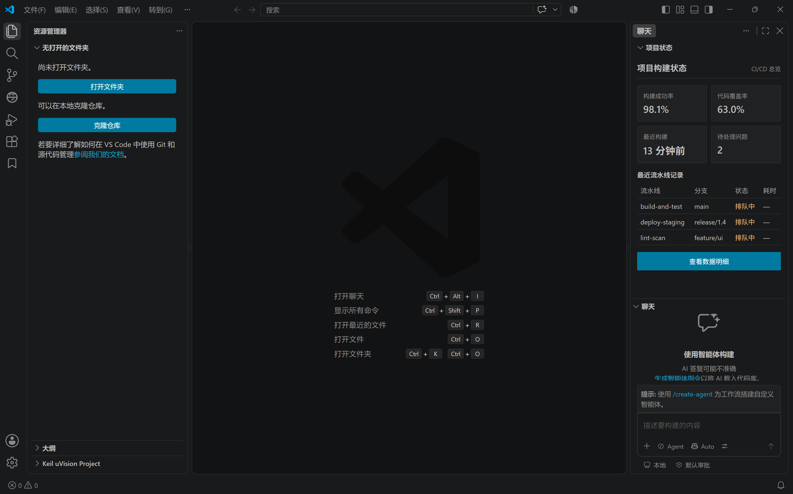
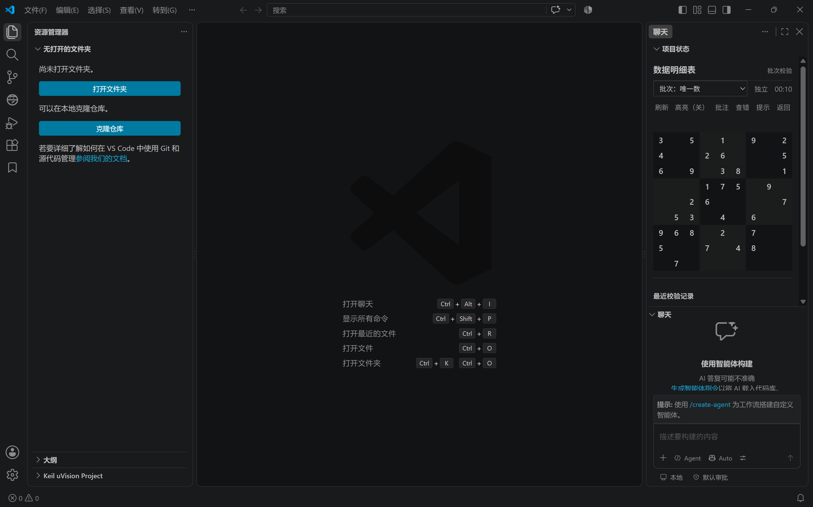

# 摸鱼数独（Moyu Sudoku）

伪装成项目状态看板的 VSCode 数独小游戏。  
A stealth sudoku disguised as a project status dashboard.

GitHub: [fornarwhal/moyu-sudoku](https://github.com/fornarwhal/moyu-sudoku) · Marketplace: [fornarwhal.moyu-sudoku](https://marketplace.visualstudio.com/items?itemName=fornarwhal.moyu-sudoku)

## 功能

- 四档技巧难度：唯一数 / 隐藏单数 / 数对区块 / 试数推理
- 伪装看板 + 老板键（`Ctrl+Alt+S` 切换，`Esc` 隐藏）
- 撤销 / 重做、笔记 / 查错、提示高亮
- 自动存档，数据仅存本地

## 截图

## 安装

- 扩展市场搜索 `moyu sudoku`，或打开 [Marketplace](https://marketplace.visualstudio.com/items?itemName=fornarwhal.moyu-sudoku)
- 或用 VSIX：`Ctrl+Shift+P` → **Install from VSIX...** → 选择 `摸鱼数独.vsix`

## 快捷键

| 操作 | 按键 |
| --- | --- |
| 切换看板/数独 | `Ctrl+Alt+S` |
| 返回看板 | `Esc` |
| 填数 | `1-9` |
| 笔记 | `N` |
| 提示 | `H` |
| 清除 | `Delete` / `Backspace` / `0` |
| 撤销/重做 | `Ctrl+Z` / `Ctrl+Y` |

快捷键可在 VSCode 键盘快捷方式中修改。

## 设置

- `moyuSudoku.hideKey`：隐藏键（`Escape` / `F12` / `` ` ``）
- `moyuSudoku.autoHideOnBlur`：窗口失焦自动隐藏（默认关）
- `moyuSudoku.conflictHighlight`：冲突数字提示（默认开）
- `moyuSudoku.ratingThresholds`：评级时间阈值

## 许可

MIT
